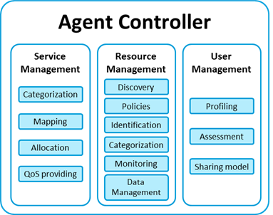

# UserManagement
Agent Controller - User Management module

[](https://opensource.org/licenses/Apache-2.0)

&copy; Atos Spain S.A. 2017

The User Management module is a component of the European Project mF2C.

-----------------------

[Description](#description)

[Component architecture](#component-architecture)

[Installation Guide](#installation-guide)

[Usage Guide](#usage-guide) (Test component)

[Relation to other mF2C components](#relation-to-other-mf2c-components)

-----------------------

### Description

The User Management module is responsible for managing the user’s profile and the definition of the user’s device resources that will be shared in mF2C.
It is also responsible for checking that the mF2C applications act according to these sharing model and profile properties.

-----------------------

### Component architecture

This module is part of the Agent Controller component:



This module is composed of three components:
- Profiling
- Sharing Model
- User Management Assessment

-----------------------

### Installation Guide

#### 1. Requirements

1. [Docker](https://docs.docker.com/install/)
2. [Docker-Compose](https://docs.docker.com/compose/install/) (for integration with other components)

Dockerfile content:

```
FROM python:2.7.14-jessie
#FROM python:3.4-alpine
ADD . /code
WORKDIR /code
RUN pip install -r requirements.txt
EXPOSE 46300
CMD ["python", "app.py"]
```

About the python image used in the Dockerfile...

- *python:2.7.14-jessie*: this image should be used when working directly with Dataclay - Data Management module
    - Dataclay needs python 2.7.9 - 2.7.14
- *python:3.4-alpine*: when using only CIMI
    - 3.* (not tested with CIMI)

#### 2. Install

###### 2.1 Launch with Docker

How to install the User Management module:

1. Clone / download repository

```bash
git clone https://github.com/mF2C/UserManagement.git
```

2. Go to UserManagement folder

```bash
cd UserManagement
```

3. Build application:

```bash
sudo docker build -t um-app .
```

4. Run application:

```bash
sudo docker run -p 46300:46300 um-app
```

5. REST API can be accessed at port 46300:

     - List of services (json): _https://localhost:46300/api/v1/user-management_

     - List of services (swagger ui): _https://localhost:46300/api/v1/user-management.html_

###### 2.2. Launch with Docker-Compose

How to install the User Management module and other components:

_-not ready-_

###### 2.3. Launch application and dataClay

_-not ready-_


#### 3. Working with Dataclay - Data Management module

1. Download [Dataclay](https://github.com/mF2C/dataClay)

2. Initialize the Dataclay services

```bash
cd orchestration
docker-compose rm  # to clean the previous containers, if exist
docker-compose up
```

###### 3.1. User Mgmt module

1. register

```bash
sudo bash register.sh
```

2. launch python virtualenv

```bash
virtualenv env
source env/bin/activate
```

```bash
deactivate
```

3. Edit _client.properties_ file

```bash
HOST=192.168.252.42
TCPPORT=11034
```

4. launch application

(/usr/bin/python2.7)

```bash
python rest_api.py
```

-----------------------

### Usage Guide

After installing the User Management module, the REST API services can be accessed at port 46300:

     - List of services (json): _https://localhost:46300/api/v1/user-management_

     - List of services (swagger ui): _https://localhost:46300/api/v1/user-management.html_

#### Test component

_-not ready-_

-----------------------

### Relation to other mF2C components

The User Management module is connected with the following mF2C components:

- Is called by the following modules / components:
    - Lifecycle Management: it needs information about the profiling and sharing model before 'launching' a service
    - ...
- Makes calls to the following modules / components:
    - Landscaper:
    - Lifecycle Management:
    - ...
