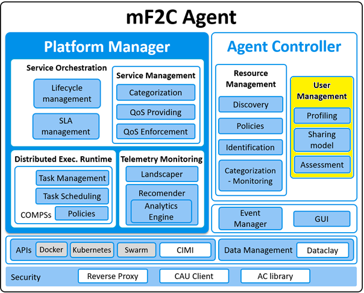

# UserManagement
Agent Controller - User Management module

[](https://opensource.org/licenses/Apache-2.0)

&copy; Atos Spain S.A. 2017

The User Management module is a component of the European Project mF2C.

-----------------------

[Description](#description)

[Component architecture](#component-architecture)

[Installation Guide](#installation-guide)

[Usage Guide](#usage-guide)

[Relation to other mF2C components](#relation-to-other-mf2c-components)

-----------------------

### Description

The User Management module is responsible for managing the user’s profile and the definition of the user’s device resources that will be shared in mF2C.
It is also responsible for checking that the mF2C applications act according to these sharing model and profile properties.

-----------------------

### Component architecture

This module is part of the Agent Controller component:



This module is composed of three components:
- Profiling
- Sharing Model
- User Management Assessment

-----------------------

### Installation Guide

#### 1. Requirements

1. [Docker](https://docs.docker.com/install/)
2. [mF2C CIMI server](https://github.com/mF2C/cimi)

Dockerfile content:

```
FROM python:3.4-alpine
ADD . /code
WORKDIR /code
RUN pip install -r requirements.txt
EXPOSE 46300
CMD ["python", "app.py"]
```

#### 2. Install & Launch with Docker

1. [Install and launch the CIMI server](https://github.com/mF2C/cimi/tree/master/_demo)

2. Clone / download repository

```bash
git clone https://github.com/mF2C/UserManagement.git
```

3. Go to UserManagement folder

```bash
cd UserManagement
```

4. Build application:

```bash
sudo docker build -t um-app .
```

5. Run application:

```bash
sudo docker run -p 46300:46300 um-app
```

```bash
sudo docker run --env CIMI_URL=https://192.192.192.192 -p 46300:46300 um-app
```

6. REST API can be accessed at port 46300:

     - List of services (json): _https://192.192.192.192:46300/api/v1/user-management_

     - List of services (swagger ui): _https://192.192.192.192:46300/api/v1/user-management.html_

-----------------------

### Usage Guide

Create one or more users by executing `create_user.py`
    - Edit the URLs of this file before executing it:

```python
r = requests.post('https://192.192.192.192/api/user',
                  verify=False,
                  headers={'Content-Type': 'application/json',
                          'Accept': 'application/json'},
                  json=body)
```

Launch the User Management module...

```bash
sudo docker run --env CIMI_URL=https://192.192.192.192 -p 46300:46300 um-app
```

Other environment variables that can be defined when launching the service:

- CIMI_USER
- CIMI_PASSWORD
- CIMI_COOKIES_PATH

```bash
sudo docker run --env CIMI_URL=https://192.192.192.192 --env CIMI_USER="testuser" --env CIMI_PASSWORD="testuserpassword"  --env CIMI_COOKIES_PATH="~./cookies" -p 46300:46300 um-app
```

After installing the User Management module, the REST API services can be accessed at port 46300:

     - List of services (json): _https://192.192.192.192:46300/api/v1/user-management_

     - List of services (swagger ui): _https://192.192.192.192:46300/api/v1/user-management.html_

-----------------------

### Relation to other mF2C components

The User Management module is connected with the following mF2C components:

- Is called by the following modules / components:
    - Lifecycle Management: it needs information about the profiling and sharing model before 'launching' a service

- Makes calls to the following modules / components:
    - Landscaper: ??
    - Lifecycle Management: it sends the Lifecycle warnings when mF2C uses more resources than defined by the user
